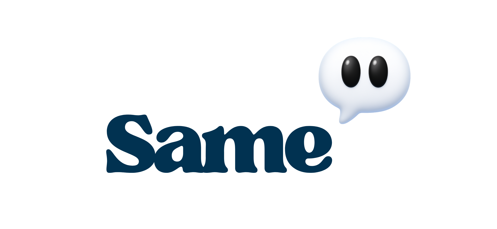

# Same

## Description :
Same est une plateforme de discussion destinée aux élèves et étudiants à Genève. Le projet a pour but de créer un espace simple, moderne et sécurisé pour permettre aux jeunes de discuter, poser des questions et s’entraider sur des sujets scolaires, personnels ou sociaux.

## Objectif du projet :
Le but de Same est de proposer une alternative claire et utile aux réseaux sociaux classiques, en se concentrant uniquement sur des échanges entre étudiants dans un cadre sain, organisé et adapté au monde scolaire.

L'idée vient de l'addiction constante aux réseaux sociaux des élèves, que se soit durant les pauses où même parfois en classe.

Nous souhiatons revenir à l'idée de base des réseaux sociaux, le but principal étant de connecter les gens entre eux.

## Fonctionnalités principales :

	•	Création de compte utilisateur
	•	Connexion sécurisée
	•	Publication de posts
	•	Discussions par thème
	•	Interface simple et intuitive
	•	API backend sécurisée
	•	Base de données relationnelle
